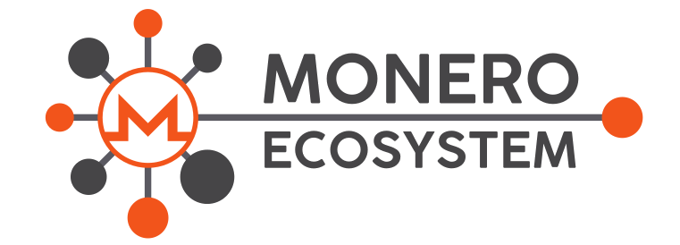

 

&nbsp;

 
 
 
 

# What is the Monero Ecosystem project?
Many Monero related repositories are on GitHub and some are very interesting and important, but they are often uploaded on personal accounts. This limits the visibility of the repository, making contributions and maintenance much harder.
&nbsp;

The goal of the 'Monero Ecosystem' is to gather all relevant repositories in just one place, easy to find and manage for both maintainers and contributors.  
Feel free to open an issue if you have suggestions/proposals.

# Projects

| Repository | Description | Maintainer(s) | 
| --- | --- | --- |
|[Meta](https://github.com/monero-ecosystem/meta) | Meta repository for general management of the Monero Ecosystem project | erciccione |
| [monero-ecosystem.github.io](https://github.com/monero-ecosystem/monero-ecosystem.github.io) | Website of the Ecosystem | Lafudoci |
| [Revuo-Monero](https://github.com/monero-ecosystem/Revuo-Monero) | The quarterly Revuo Monero | rehrar |
| [monero-GUI-guide](https://github.com/monero-ecosystem/monero-GUI-guide) | Guide for the [Monero GUI Wallet](https://github.com/monero-project/monero-gui) | erciccione |
| [Stellumo](https://github.com/monero-ecosystem/Stellumo) | A project to render the entire Monero blockchain as fractal art | Starmute |
| [promo-video](https://github.com/monero-ecosystem/promo-video) | Text and translations of all the community videos | ajs-xmr |
| [Monero-Crypto-Lock](https://github.com/monero-ecosystem/Monero-Crypto-Lock) | Programmable locks via public-key cryptography using Monero | dougbebber |
| [monero-pgp-messenger](https://github.com/monero-ecosystem/monero-pgp-messenger) | Send PGP encrypted messages via Monero/IPFS | ajs-xmr |
| [XMR-ETA](https://github.com/monero-ecosystem/XMR-ETA) | A tool predicts the Estimated Time of Arrival of Monero (XMR) transaction | Lafudoci |
| [dont-buy-monero-sticker](https://github.com/monero-ecosystem/dont-buy-monero-sticker) | The 'Don't buy Monero' sticker. Print it and spread it! | emesik, erciccione|
| [slow-hash](https://github.com/monero-ecosystem/slow-hash) | Implementation of Monero's hash function in pure python | NoThisIsPatrik |
| [monero-designs](https://github.com/monero-ecosystem/monero-designs) | Collection of designs for Monero | Rehrar |
| [monero-translations](https://github.com/monero-ecosystem/monero-translations) | General management repo for the Monero Localization Workgroup |erciccione |
| [qml-xmr](https://github.com/monero-ecosystem/qml-xmr) | Mock QML components for Monero-GUI | xmrdsc |
| [outreach-docs](https://github.com/monero-ecosystem/outreach-docs) | Monero's community outreach and education wing | lh1008, erciccione |
| [moneriote-python](https://github.com/monero-ecosystem/moneriote-python) | Python scripts to maintain Monero opennodes DNS records | Lafudoci |
| [python-monerorpc](https://github.com/monero-ecosystem/python-monerorpc) | Improved version of python-jsonrpc for Monero (monerod rpc, monero-wallet-rpc) | normoes |
| [monero-java-rpc](https://github.com/monero-ecosystem/monero-java-rpc) | Java interface for managing a Monero wallet | woodser |
| [submit-tx-via-tor](https://github.com/monero-ecosystem/submit-tx-via-tor) | Bash script to submit raw Monero transactions over Tor | xmrdsc |
| [Pymonero](https://github.com/monero-ecosystem/pymonero) | Fork of monero-project/monero to deliver python c++ bindings | ehanoc |
| [MoneroBox](https://github.com/monero-ecosystem/monerobox) | MoneroBox aims to make a plug-and-play, zero-configuration Monero full node running on a Single-Board-Computer such as Rock64 and Raspberry Pi 3 | Jasonhcwong |
| [Monero-Javascript](https://github.com/monero-ecosystem/monero-javascript) | Monero wallet and daemon JavaScript API | Woodser |
| [Monero-Python](https://github.com/monero-ecosystem/monero-python) | A comprehensive Python module for handling Monero cryptocurrency | emesik |
| [go-monero-rpc-client](https://github.com/monero-ecosystem/go-monero-rpc-client) | Client for the Monero RPC (wallet and daemon) in golang | omani |
| [monero-rpc-rs](https://github.com/monero-ecosystem/monero-rpc-rs) | RPC client written in Rust for Monero daemon and wallet | vorot93 |
| [vanity-monero](https://github.com/monero-ecosystem/vanity-monero) | Generate vanity address for Monero | Equim-chan |
| [MoneroTipper](https://github.com/monero-ecosystem/MoneroTipper) | Non-custodial Monero tip bot for Reddit | dginovker |

# Join the Ecosystem!
If you have a monero related repository you want to add, open an issue in the 'meta' repository, saying why you want to join us and what you plan for your project. You'll be added as a member of the project and all permissions, commits, history, licenses will be inalterated and you will be the maintainer, with no differences from before, but you will get the shiny 'Monero Ecosystem' badge on GitHub. Please, ask to transfer a repo only if you plan to keep it updated.
&nbsp;

Transfering a repo on the Monero Ecosystem means that the repository will be *moved* from the personal account, not cloned or mirrored and **all development will happen inside the project 'Monero Ecosystem'**. This means that the maintainers, if for some reason prefer to keep a personal fork, shouldn't commit on their personal clone and only keep it as a mirror, or the risk is to create confusion for both users/contributors (which could not have clear which one is the active repo) and maintainers (which could create conflicts between the repos or mess up the git history). The repository is still owned by the maintainer and can be moved back to the personal profile in any moment, if desired.
&nbsp;

Be aware that when you transfer the repository, the founder of the Monero Ecosystem project (ErCiccione), will have push access to the repo. This is something not avoidable, GitHub gives to the founder admin access to all the repositories in the project. Obviously, these powers will *never* be used and hopefully, sometime in the future, GitHub will give the possibility to not give the founder of the project god-access to the repositories.

# Governance system
When a repo maintainer joins the ecosystem (s)he becomes part of our governance system, where all maintainers have equal power and decide how the project is structured and maintained. The governance system works as follow:

+ The team who decide which proposals should be included and which not is composed by all repo maintainers inside the ecosystem. ErCiccione keeps a veto right as steward of the project (to be used only in extreme cases).
+ Proposals to add and remove a new repository should be posted on the *meta* repo using the issue tracker.
+ A repository will be accepted/removed when 50%+1 of the maintainers participating to the discussion reach consensus.
+ Substantial decisions about the Monero Ecosystem project shall be made using the same system as for the precedent point.
+ Maintainers shall declare their intention of vote using: the 'thumb up' (+1) or 'thumb down' (-1) buttons on GitHub, commenting with `ACK` (Acknowledged) or `NACK` (Not Acknowledged) or clearly expressing their vote.

 

*Credits to [The Monera](https://www.themonera.art/) for logo and banner*
